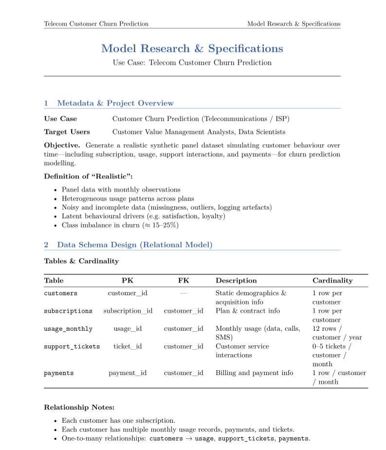
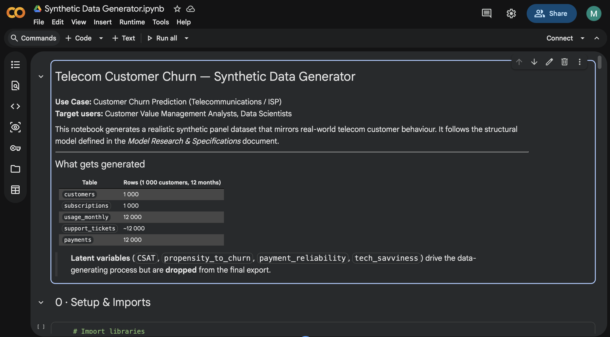
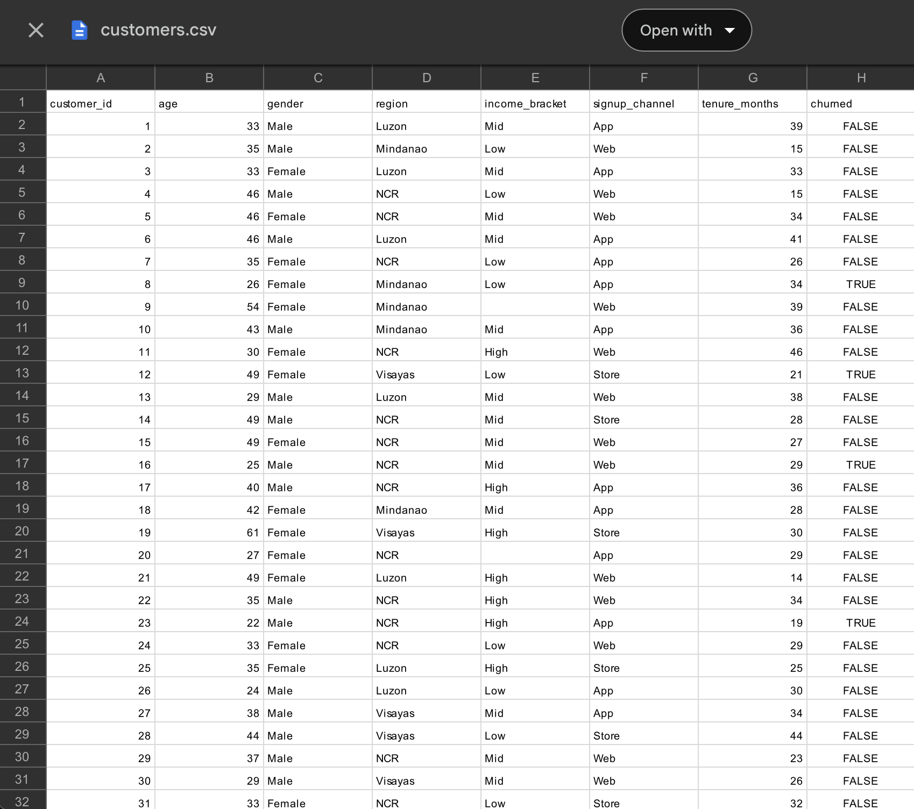
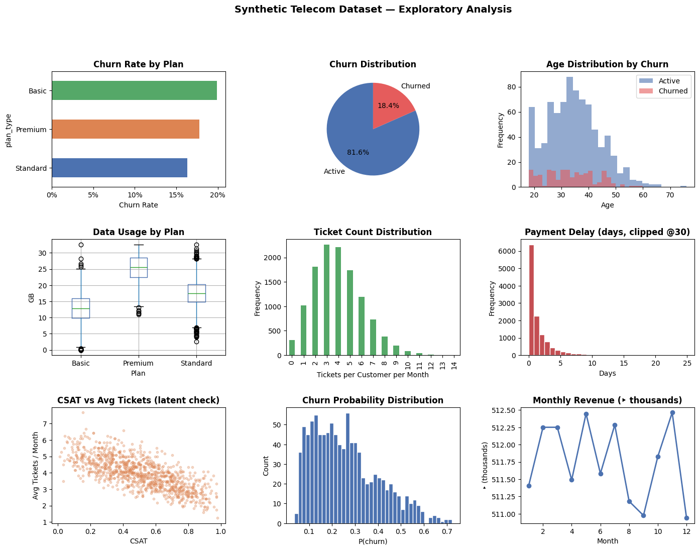
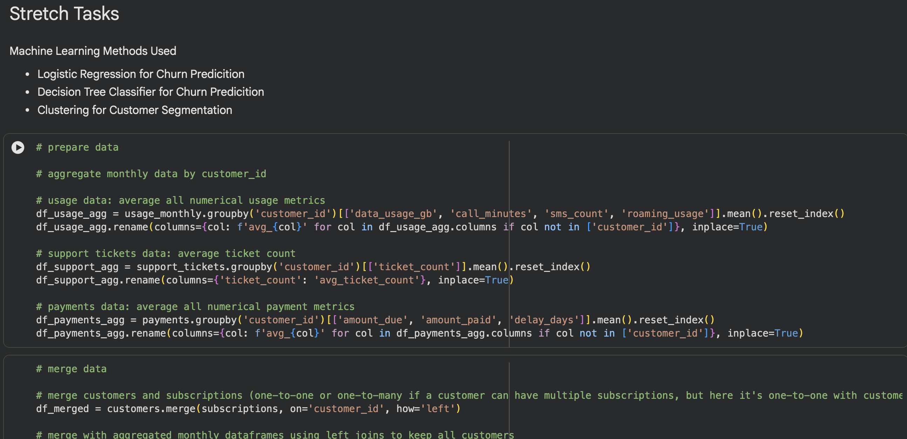

# 👋 Hi, I'm Mark Edrian Celemen

**Computer Science Student @ De La Salle University**  
Eskwelabs Innovation Fellow (Cohort 9)

---

## 🧭 About Me

I'm a Computer Science student from De La Salle University with a background in **statistics** (intermediate), **Python programming** (intermediate), **data science** (beginner), and **AI/ML** (beginner). I joined the Eskwelabs Innovation Fellowship to explore whether data science or software engineering is the right career path for me.

---

## 🏫 My Eskwelabs Innovation Fellowship Journey

**Track:** Data Modeling  
**Focus:** Building a synthetic dataset pipeline for a Customer Churn Prediction use case, targeting **Customer Value Management Analysts**.

---

## 📁 Project Portfolio — Telco Customer Churn Prediction Dataset

### Context

Designed a multi-table relational dataset simulating customer churn behavior, with tables for `customer`, `subscriptions`, `usage_monthly`, `support_tickets`, and `payments`. The dataset meets comprehensive criteria across structural (e.g. 20+ features and 3+ tables), relational (e.g. with primary or foreign key, 1-to-1 or 1-to-many), noise / real-world messiness (e.g. randomness, duplicates, missing values), and more.

---

### 📄 Deliverable 1 — Model Research & Specification Document

A formal specification document outlining the dataset design: use case framing, schema definitions, feature descriptions, relationships, adata generation assumptions, etc.

>   
> *First page of the document*

---

### 🧪 Deliverable 2 — Synthetic Dataset Generator & Synthetic Datasets

A Python notebook that generates the full multi-table synthetic dataset from scratch using `pandas`, `numpy`, and more, with reproducibility ensured via random seeds.

| Code Snippet | Customer Table Dataset Snippet |
|:---:|:---:|
|  |  |

---

### 📊 Deliverable 3 — Exploratory Data Analysis (EDA) Notebook

An independent EDA notebook featuring descriptive statistics, distributions, trends, and correlation analysis across the synthetic datasets.

>   
> *Data Visualization of the Synthetic Dataset*

---

### ⭐ Other Deliverables — Cleaned Datasets & Machine Learning (Stretch Task)

Beyond the core deliverables, I cleaned the generated datasets and applied machine learning techniques including data preparation, supervised learning (classification & regression), unsupervised learning (clustering), feature engineering, model training, model evaluation.

>   
> *Code Snippet*

---

## 🛠️ Skills Demonstrated

### Core — Data Science & Engineering

| Area | Skills |
|---|---|
| **Data Modeling & Design** | Relational schema design, synthetic data generation, feature/data type definition, translating business problems into data models |
| **Statistical Thinking** | Probability distributions, variable relationships, noise/randomness simulation, handling class imbalance |
| **Causal & Analytical Thinking** | Identifying churn drivers, latent variable modeling, designing realistic variable dependencies |
| **Python & Data Engineering** | Modular Python code, `pandas`/`numpy`, reproducibility with random seeds, scalable data generation |
| **Data Preparation & Cleaning** | Handling missing values, outliers, and inconsistencies; preparing datasets for analysis |
| **Exploratory Data Analysis** | `matplotlib`/`seaborn`, Descriptive statistics, distribution/trend/correlation visualizations, anomaly identification |

### Stretch — Machine Learning

| Area | Skills |
|---|---|
| **Data Prep for ML** | Feature selection & engineering, encoding, train/test splitting, feature scaling |
| **Supervised Learning** | Classification models (churn prediction), regression models |
| **Unsupervised Learning** | Clustering (customer segmentation), business insight interpretation |
| **Model Training & Tuning** | `scikit-learn`, hyperparameter adjustment |
| **Model Evaluation** | Accuracy, Precision, Recall, F1, AUC-ROC, RMSE, MAE |
| **Model Interpretation** | Key feature drivers, translating results into business insights |

### Business & Communication

- Framing a business problem (customer churn)
- Thinking from the perspective of a Customer Value Management Analyst
- Translating data findings into actionable insights
- Clearly documenting methodology and assumptions

---

## 🔁 End-to-End Workflow

```
Data Creation → Data Preparation → Exploratory Analysis → Modeling → Insights
```

---

## 💬 Reflection

**What I learned:**  
- I learned soft and hard skills related to data science

**What I'm proud of:**
- I confirmed that data science is the right career for me
- I completed the EDA notebook and ML stretch task without AI assistance

**What I'd improve next time:**
- Aapply model tuning/optimization techniques to improve metric results
- Build a dashboard** using Streamlit or Power BI to present the dataset interactively

---

## 🚀 What's Next

- Build more **end-to-end data science projects** that covers programming, math/statistics, ML, and domain knowledge with dashboards or MLOps components
- Secure my **next data science internship**
